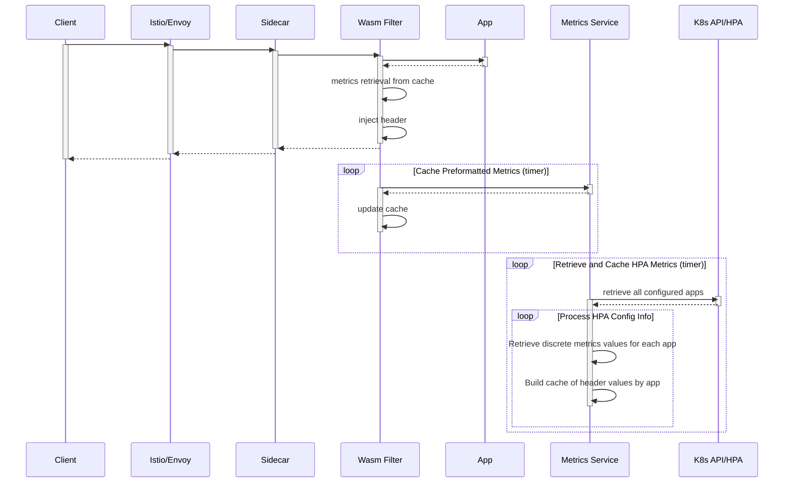

# Istio Filter

> Burst Header Istio filter with Rust and Web Assembly

## Errors

- `cargo test --target wasm32-unknown-unknown` is currently failing
  - upstream bug in proxy_wasm::*

## Wait for installation to complete

- Check the installation status

   ```bash

   cat ~/status

   ```

### Verify the setup

- You will see the burst header in the http request
- You will not see the burst header in the curl request
- The filter uses the `UserAgent header` to determine if it should add the header

```bash

# may have to retry a couple of times as the cluster warms up
make check

```

### Add load

- Run a load test in the background

```bash

# Run a 60 seconds test in the background
make test seconds=60 > /dev/null 2>&1 &

# press enter a few times to clear background output

```

- Check the burst header
  - After 20-30 seconds, you will see the second pod created

```bash

make check

watch -n 1 kubectl get pods
# Notice one more ngsa pod will pop up
# Press Ctrl+C once done

```

- The `HPA` will scale back to one pod in a few minutes

- [Optional] To scale down immediately run the following commands:

```bash

  # Delete current HPA
  kuebctl delete hpa ngsa
  # Scale down replicas
  kuebctl scale --replicas=1 deployment/ngsa
  # Recreate the HPA
  kuebctl autoscale deployment ngsa --cpu-percent=40 --min=1 --max=2

```

## Filter at Ingress Gateway

By default the filter is applied at the istio sidecar in NGSA pods.

To apply the filter at the ingress gateway level, do the following:

```bash

# Clear current filter configuration
make clean

# Now apply the wasm filter at the ingress gateway
make deploy-gateway

# Now check the burst headers
make check-gateway

```

To apply a load goto [Add Load](#add-load) section then check the header using `make check-gateway`.

### Resolve application hostname within ingress filter

When deploying the sidecar filter, the application deployment and namespace values were provided directly into the filter config. This is not suitable for the ingress filter for multiple reasons:
 - Multiple apps interact with ingress gateway and thus the filter. Providing deployment/ns values for all apps in the config is inefficient
 - The app's service name might not always be the same as the deployment name or HPA name. The burst metrics service should return app metrics given an HPA, deployment or service name

The following code is key to addressing the mentioned problems. This involves reading the Istio `cluster_metadata` property to retrieve the app's hostname that the request is being routed to. This hostname is formatted as `<app-service-name>.<namespace>.svc.cluster.local`, which is the common hostname structure for apps within a K8S cluster.

```rust
get_property(vec![
  "cluster_metadata",
  "filter_metadata",
  "istio",
  "services",
  "0",
  "host",
])
```

As the hostname contains the service name and the namespace, we simply extract these values from the string, send them in a request to the burst metrics service and attach the resulting metrics into the request as usual. Quite important to note that the burst metrics service should now support endpoints for the service name, since that's the only information available within the WASM filter. Refer to the [API Endpoints](burst/README.md#api-endpoints) for more information on the burst metrics service endpoints.

## Use custom metrics from prometheus

NgsaRequestsPerSecond is exposed to the HPA as a custom metrics.

NgsaRequestsPerSecond is used in addition to CPU metrics to scaled HPA.

```bash

# Deploy prometheus, prometheus adapter and recreate HPA with custom metrics
# It will take a min or two
make prom-adapter-hpa

# Watch for the new custom metrics to be avaialbe
watch -n 1 kubectl get hpa ngsa
# Should output similar lines below (otherwise one or two would be Unknown)
## NAME   REFERENCE         TARGETS           MINPODS   MAXPODS   REPLICAS   AGE
## ngsa   Deployment/ngsa   499m/50, 2%/50%   1         2         2          14m

# Press Ctrl+C to stop watch once done

```

Now follow [Add Load](#add-load) section to apply load to the ngsa app.

## Request Flow

The following diagram depicts the request flow, metrics retrieval, and injection of headers:



The Burst Metrics Service provides a layer of indirection that prefetches, formats, and caches values that the Wasm filter will inject.  This reduces latency on the request overall and decreases the processing required within the filter.

## Links

- Building Envoy filters with Rust and WebAssembly - <https://github.com/proxy-wasm/proxy-wasm-rust-sdk>
- OIDC Sample <https://docs.eupraxia.io/docs/how-to-guides/deploy-rust-based-envoy-filter/#building-of-the-http-filter>
- Unit testing with `wasm-bindgen-test` - <https://rustwasm.github.io/docs/wasm-bindgen/wasm-bindgen-test/index.html>

### Engineering Docs

- Team Working [Agreement](.github/WorkingAgreement.md)
- Team [Engineering Practices](.github/EngineeringPractices.md)
- CSE Engineering Fundamentals [Playbook](https://github.com/Microsoft/code-with-engineering-playbook)

## How to file issues and get help  

This project uses GitHub Issues to track bugs and feature requests. Please search the existing issues before filing new issues to avoid duplicates. For new issues, file your bug or feature request as a new issue.

For help and questions about using this project, please open a GitHub issue.

## Contributing

This project welcomes contributions and suggestions.  Most contributions require you to agree to a Contributor License Agreement (CLA) declaring that you have the right to, and actually do, grant us the rights to use your contribution. For details, visit <https://cla.opensource.microsoft.com>

When you submit a pull request, a CLA bot will automatically determine whether you need to provide a CLA and decorate the PR appropriately (e.g., status check, comment). Simply follow the instructions provided by the bot. You will only need to do this once across all repos using our CLA.

This project has adopted the [Microsoft Open Source Code of Conduct](https://opensource.microsoft.com/codeofconduct/). For more information see the [Code of Conduct FAQ](https://opensource.microsoft.com/codeofconduct/faq/) or contact [opencode@microsoft.com](mailto:opencode@microsoft.com) with any additional questions or comments.

## Trademarks

This project may contain trademarks or logos for projects, products, or services.

Authorized use of Microsoft trademarks or logos is subject to and must follow [Microsoft's Trademark & Brand Guidelines](https://www.microsoft.com/en-us/legal/intellectualproperty/trademarks/usage/general).

Use of Microsoft trademarks or logos in modified versions of this project must not cause confusion or imply Microsoft sponsorship.

Any use of third-party trademarks or logos are subject to those third-party's policies.
