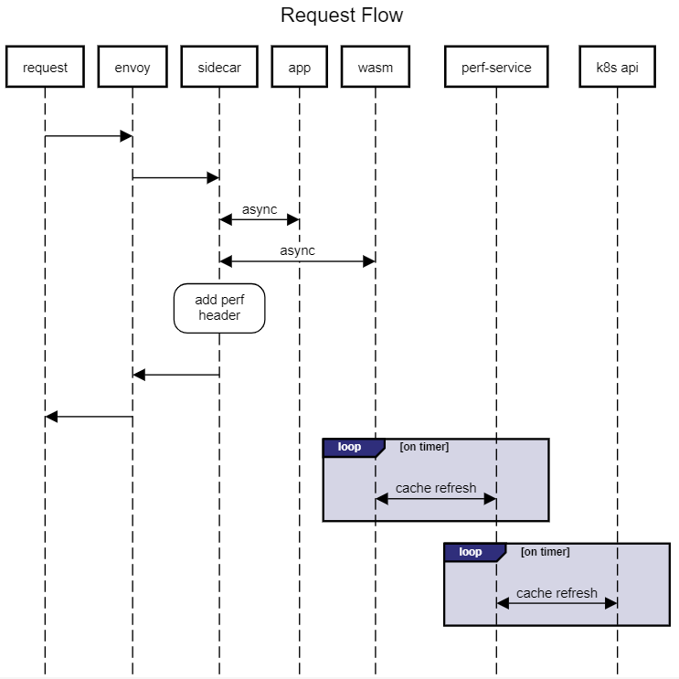

# Istio Filter

> Sample Istio filter with Rust and Web Assembly

## TODO

- Not working yet
  - Prometheus
  - Grafana
  - need to figure out what has to be deployed vs make create
    - make clean
    - make deploy

## Run Istio Web Assembly

- Create the kind cluster

   ```bash

   make create

   ```

### Set env vars

> Do not forget this step!

```bash

# load new env vars
# exit and start new shell will also work
source ~/.bashrc

```

### Verify the setup

```bash

# may have to retry a couple of times
make check

```

### Add load

- Start a new terminal window

```bash

make test

```

- Go back to previous terminal

```bash

make check

```

## Request Flow



## Links

- Building Envoy filters with Rust and WebAssembly - <https://github.com/proxy-wasm/proxy-wasm-rust-sdk>
- OIDC Sample <https://docs.eupraxia.io/docs/how-to-guides/deploy-rust-based-envoy-filter/#building-of-the-http-filter>
