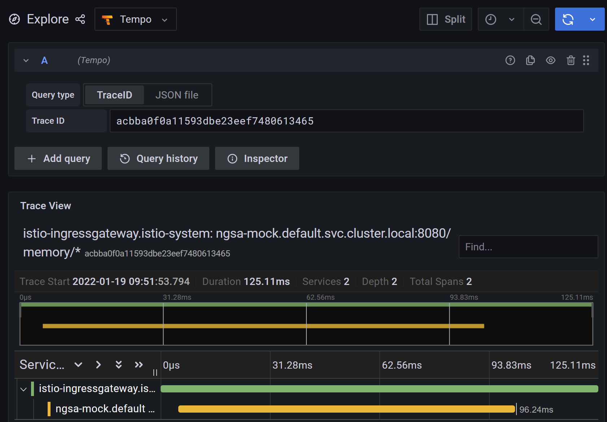
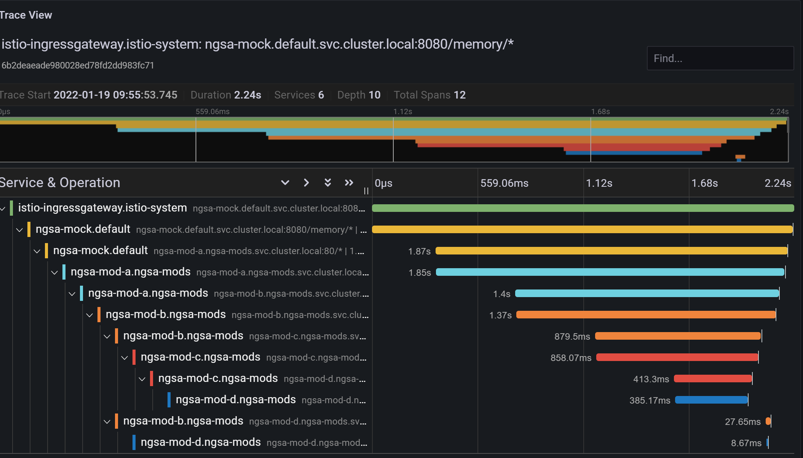
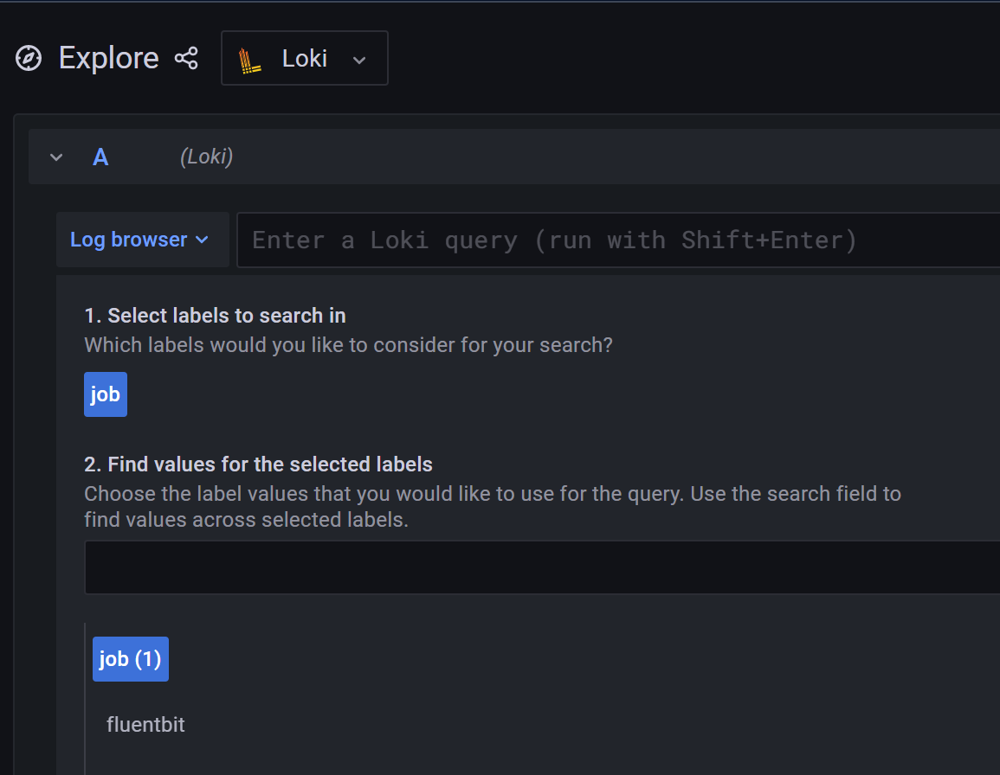
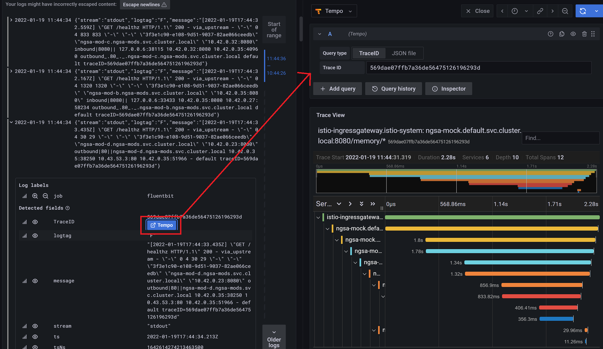

# Grafana Tempo Demo

> Showcasing grafana with Istio and Ngsa application.
> Ngsa app was modified to help showcase multiple service req and
> with Istio Header propagation and trace logging

## Why Grafana Tempo

In enterprise microservices world, a request coming through a gateway or
loadbalancer travels through hundreds of services before serving a user
what they need.

Tracking these services with no insight into how the system performs can become
a real engineering challenge in a scalable system. And that's where distributed
tracing comes into the picture.

From Grafana Tempo site:
> Grafana Tempo is an open source, easy-to-use, and high-scale distributed
> tracing backend. Tempo is cost-efficient, requiring only object storage to
> operate, and is deeply integrated with Grafana, Prometheus, and Loki.
> Tempo can ingest common open source tracing protocols, including Jaeger,
> Zipkin, and OpenTelemetry.

## Deployment

```bash
# Step 0. 
## From your REPO root dir
cd spikes/grafana-tempo

# Step 1: Create the cluster
make delete create
## Check pods
kubectl get po -A

# Step 2: Deploy istio, grafana, tempo and loki
make istio-tempo

## Check Grafana stack
kubectl get all -n tracing
## Loki node-exporter pod might be showing error
## Which for the purpose of this spike is not required
kubectl get all # one ngsa-app deployed in default namespace

# Step 3: Build and push modified ngsa-app
make build-ngsa

# Step 4: Install mock ngsa-applications
## At this point we only have one application ngsa-app
## We would like to have couple more ngsa with interdepencies to other ngsa apps
## to demonstrace tracing capabilities which span multiple services
## before returning to user

make install-mocks

## We have now deployed root ngsa-mock service which depends on four other 
## ngsa services. See the service dependency chart below
    # Chain dependency for ngsa-mock
    # [ingress]-->[ngsa-mock]-->[mock-a]-->[mock-b]
    #                      └--->[mock-c]<---┘    |
    #                             └-->[mock-d]<--┘
## Check all the mock ngsa apps deployed
kubectl get all # in the default namespace

```

We've deployed all the services we needed.

Now lets explore our Grafana UI from browser.

- If you're using codespaces in VSCode just goto "http://127.0.0.1:30083/explore" in your browser.
- If using codespaces from browser, goto `PORTS` and visit the port 30083.

> If you can't access, try to make the port public (see [this](https://docs.github.com/en/codespaces/developing-in-codespaces/forwarding-ports-in-your-codespace#sharing-a-port))

Click on Explore button and you'll land here:
![Grafana Explore[Tempo]](imgs/tempo_landing.png)

In a terminal:

```bash

# Request the ngsa-memory/version via istio ingress
http localhost:30082/memory/version
## Here 30082 is the nodeport for Istio Ingress
## /memory is the virtual service router for ngsa-memory

```

It should return something like this

> HTTP/1.1 200 OK
> content-type: text/plain
> date: Wed, 19 Jan 2022 15:41:30 GMT
> istio-request-id: 00100fc1-4ca0-9d23-ab20-c64a28a35d4f
> istio-trace-id: 962b886eb46c8077ca35f6a7131671c7
> server: istio-envoy
> transfer-encoding: chunked
> x-envoy-upstream-service-time: 124
>   
> 0.5.0-0118-1756

Copy the value of `istio-trace-id` and paste it in the Grafana Tempo and run the query


This is an example of simple one service query.

Now in terminal do: `http localhost:30082/memory/healthz`. Requesting `healthz`
endpoint will call other ngsa services in chain.

Now copy and paste the `istio-trace-id` into Grafana Tempo UI and run the query.
You'll see ngsa call other ngsa services.


## Tracing with Loki

Now good thing about using Grafana and Loki is that we can connect our traceIDs
right in our logs to Tempo using Loki's derived fields.

It is already configured when we deployed Grafana.
Checkout  [this yaml file](./istio/grafana-single-values.yaml) for configuration details.

To see the logs, from Grafana Explore, change the data source to Loki.


Now, fluent bit properly labled, so click on "Log Browser" and select "job" and "fluentbit".


From there you can click on any logs and if that log has traceID, it will
automatically link to Tempo.

