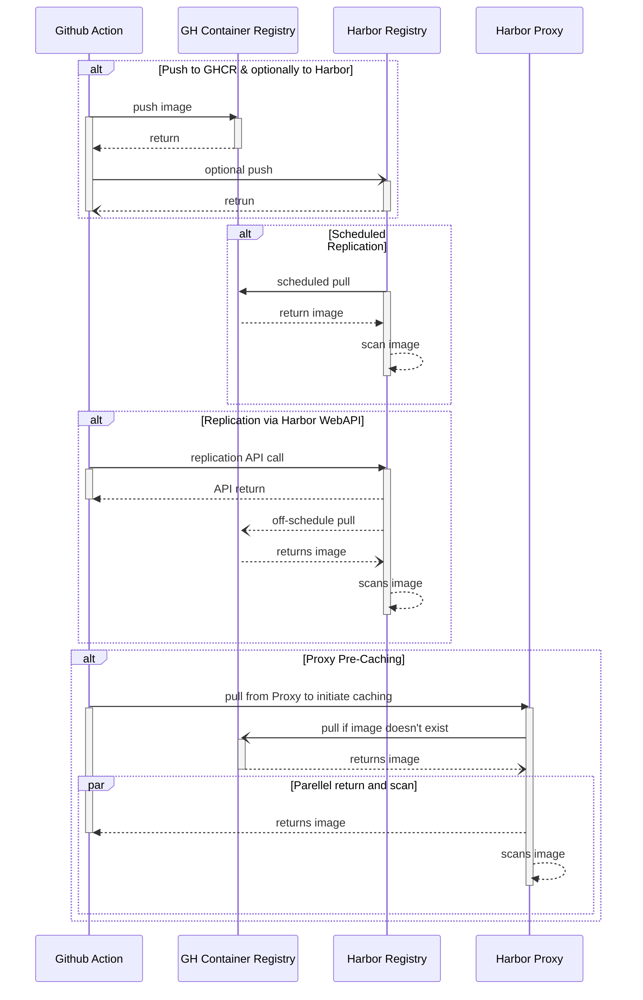
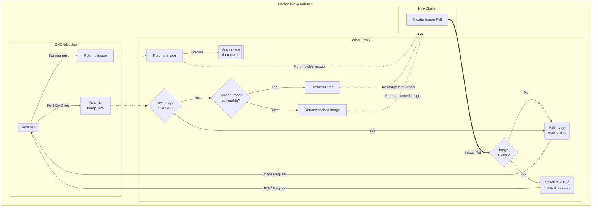

# Deploy Harbor

## Azure ASB Cluster

> The steps below are guidelines for the dev cluster, but is replicable for the pre-prod as well

- Create a dns entry for harbor (*harbor-core-westus2-dev.cse.ms*) `rg-ngsa-asb-dev/cse.ms` private dns and put the Load-Balancer IP address for Westus2.
- Create a public dns entry `harbor-core-westus2-dev.cse.ms` in `dns-rg/cse.ms` and put the public ip for WestUS2 dev cluster
- Add below settings for harbor (similar to ngsa apps) in Application Gateway:
  - Backend pool
  - Backend settings (with no custom probes, that we don't have to configure probes)
  - Listeners (http and https)
  - Rules (http and https)
- Add an exception for the harbor-host in the WAF policy (e.g. for WestUS2-dev you'll add it in `rg-ngsa-asb-dev/ngsa-asb-waf-policy-westus2`)

At this point Harbor should be ready to deploy.
Now we need to make sure our cluste can pull the container images.
To do that we have two options:

- We can push Harbor images into our cluster acr repo (`rg-ngsa-asb-dev/acraks3i2qzkkxofr7c`)
    > This is easier and preferable for pre-prod and dev clusters
- Or we can use another private repo and make sure our cluster can access the repo
    > This requires several extra steps and should be done for SPIKEs only

For deploying using another private repo couple of things to keep in mind:

- Add the ACR's address in `rg-ngsa-asb-dev-hub/fw-policies-eastus` allow rule collection.
- Add managed identity for the Westus2 cluster (e.g `aks-3i2qzkkxofr7c-westus2-agentpool`) to the ACR and give it `AcrPull` permissions
- Deploy helm in `azure-arc` repo, since its in the policy exception list.

Now that all of the setup is done, to deploy:

```bash
# Add harbor helm repo and update
helm repo add harbor https://helm.goharbor.io
helm repo update

# From this spike/harbor directory
## For the spike we're deploying in azure-arc directory
## but if you have access to push images to the private repo, you can deploy to any namespace
helm istall -f helm-values.yaml harbor harbor/harbor -n azure-arc --create-namespace

# Be sure to change the namespace in harbor-virtual-svc.yaml file
kuebctl apply -f harbor-virtual-svc.yaml

```

> Default user for harbor portal is admin and password is `Harbor12345`.
>
> This can be changed in `helm-values.yaml` file.

## Locally or in a VM with Docker

For deploying harbor locally we need to have these tools available:

- Bash
- Docker
- Docker Compose
- [Optional] Login to Dockerhub (to pull images)

### Steps

Follow the steps below (based on [installation config](https://goharbor.io/docs/1.10/install-config/)):

1. Download the **online** installer `wget https://github.com/goharbor/harbor/releases/download/{VERSION}/harbor-online-installer-{VERSION}.tar.gz` file from [harbor github release page](https://github.com/goharbor/harbor/releases)
    > Notes: Download the online installer: e.g `wget https://github.com/goharbor/harbor/releases/download/v2.5.1/harbor-online-installer-v2.5.1.tgz`

1. Extract the archive (assuming the extracted path is `$HARBOR_PATH`)

1. Copy `harbor.yml` to `$HARBOR_PATH` (so that `harbor.yml` will be in the same directory as `install.sh`)

1. Generate certificate for HTTPS access.

    ```bash
    # Here replace $HARBOR_PATH with the extracted dir path
    ./gen-multi-domain-certs.bash --cert-path ${HARBOR_PATH} --cert-prefix harbor-ssl -san 127.0.0.1,localhost,harboar.core.local,harbor.notary.local,harboar.local
    ```

1. Change `certificate` and `private_key` entry in `harbor.yml` file and point to `$HARBOR_PATH/harbor-ssl.crt` and `$HARBOR_PATH/harbor-ssl.key`.

    > *Note:* Use full path for `certificate` and `private_key`

1. Run the installer

    ```bash
    # Here replace $HARBOR_PATH with the extracted dir path
    cd $HARBOR_PATH
    sudo ./install.sh
    ```

1. Try `docker ps` and try the ports for `harbor-nginx` and `harbor-portal`.

## Sequence diagram for Harbor Registry and Proxy

The diagram shows four different use cases to use Harbor Proxy and Harbor Registry with existing CI/CD pipeline which includes caching and vulnerability scans.



## Flowchart for Harbor Proxy

The flowchart shows how Harbor proxy can be used in tandem with a standard
GHCR/Docker registry, providing cache and vulnerability scans.



<!-- markdownlint-disable MD033 -->
<!--- This section tracks comments and TODO -->
<span hidden>

FOLLOW UP:

- [X] AAD Integration - Delete any local user (other than admin) then integrate
- [X] Repository replication from/to other repo
- [X] Repository proxy
  - [X] Can harbor act as a proxy to other registries
    - Ans: It can
  - [X] If harbor doesn't have an image, can it pull from a know public registry and deliver
    - Ans: It can pull from most known repos, given we provide an endpoint with proper Access Keys
- [X] What happens if scanner finds issue in harbor? DevOps flow [Assuming `Prevent vulerable images from running` is selected]
  - When the scanner is running, we can't pull It will show this msg

    ```bash
        Error response from daemon: unknown: current image with "Running" status of vulnerability scanning cannot be pulled due to configured policy in 'Prevent images with vulnerability severity of "Low" or higher from running.' To continue with pull, please contact your project administrator for help.
    ```

  - Once scan is finished, it will let it pass depending on the scanner result
  - For proxy repo, the image is first pulled from source, made available to the pull
    - Then its scanned, and added to cache
    - Before scanning is finished, it is made available as a passthrough (meaning vulnerable images can be pulled for the first time)
    - At this point if policy allows, it does block further pull if vulnerable
- [X] Harbor can pull/push from remote repo --> Hence it will be able to pull and scan
- [X] Cache and scan
- [X] Replication endpoints Harbor/ACR/GHCR[X]
  - Replication (pull mode) works as usual with endpoints
  - Problem is: after first replication/pull the image is scanned and if the existing image has vulnerabilities
- [X] Azure disk/PVC classes to use in Harbor deployment
  - [X] If Azure disks have redundant backup - usually don't
  - [X] If we can use 3rd party storage used in AKS: We can
- [X] Worklfow diagram**
  - [ X Push, pull (after deployment)
  - [ X Harbor deployment workflow
- [ ] Script is preferred but also explore cluster_admin
  - Fully automatic or semi-automatic

---

- [ ] Make sure from the cluster we can pull from Harbor without going through the internet
  - DNS settings need to be changed in order for local service acting as a registry
- [ ] For Proxy: Configure to pre-pull and scan rather than passthrough before the scan
- [ ] *Multiple Harbor deployment and using Front Door as a one-stop URL
</span>
